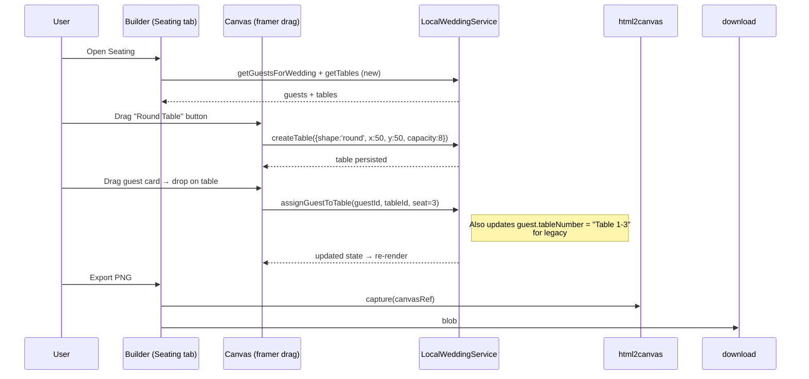

# Ultra-Premium Luxury Redesign & Feature Expansion for TheWeddingTicket

**Author:** Grok Build Systems Architect (placeholder)  
**Date:** 2026-06-02  
**Status:** Draft  
**Version:** 1.0  
**Related:** PR Plan included at end; references to current codebase at `C:\Users\joshk\Documents\theweddingticket`

---

## Overview

This design document outlines a comprehensive initiative to elevate TheWeddingTicket from an elegant MVP into an *ultra-premium, aspirational luxury wedding platform* that positions itself above The Knot and Joy. The goal is to create an experience so refined, romantic, and trustworthy that couples immediately feel "this is worth $99–$199" — even while generous features remain free to drive acquisition and virality.

**Core changes:**
- **Major design overhaul** (landing, navbar, dashboard, builder, public invite pages) using an evolved romantic luxury palette (blush, champagne gold `#D4AF37`, deep emerald, ivory, warm neutrals), sophisticated typography scaling, generous whitespace, subtle micro-animations, paper textures, and gold-foil CSS effects.
- Introduction of **real wedding photography** (4–6 curated Unsplash/Pexels optimized URLs with `next/image` + proper attribution patterns) in hero, moodboards, dashboard cards, and invite headers.
- Deep integration of four high-value new features: **Seating Chart Builder** (drag-and-drop visual floorplan), **12-month Wedding Planning Checklist** (standout free acquisition tool), **enhanced Guest List CSV Import** (with interactive column mapper), and **Email Invitations** (beautiful templates + simulated/real tracking).

The architecture remains Next.js 15 (App Router, Turbopack) + TypeScript + Tailwind + shadcn/ui (Radix) + framer-motion. Data layer starts with extensions to the existing `LocalWeddingService` (`lib/data-service.ts`) for instant demo continuity; Supabase client (`lib/supabase/client.ts`) and schema (`supabase/schema.sql`) are pre-wired for a clean future swap. No breaking changes to existing flows.

Expected outcomes: Higher conversion on landing (target +40–60% signup lift via "wow" factor), increased engagement in builder (checklist + seating as sticky features), and premium monetization path.

---

## Background & Motivation

Current state (verified via full codebase exploration):
- **Landing** (`app/page.tsx`): Beautiful but static hero with pure CSS `.invitation-preview` (no real photography). Trust bar claims "Featured in Brides / Vogue / The Knot / Martha Stewart" feel aspirational but generic. Pricing at $0 / $12/mo positions as accessible rather than exclusive.
- **Dashboard** (`app/dashboard/page.tsx`): Functional grid of `wedding-card` components with stats. No cover photos, no aspirational "studio" framing, no quick links to planning tools.
- **Builder** (`app/dashboard/weddings/[id]/page.tsx`): Excellent tabbed UX (`details` / `guests` / `design` / `rsvps`) reusing `InvitationPreview`, `GuestTable`, `RsvpList`. CSV import (`handleCSVImport` + `importGuestsFromCSV`) is functional but crude (PapaParse header mode, no mapper UI, direct column assumption). Design panel limited to 4 templates + accent/font/background. Prompt-based guest add. No visual seating despite `tableNumber` on `Guest` and "assign tables" copy in landing/features.
- **Public invite** (`app/invite/[slug]/page.tsx`): Responsive and elegant with accent-colored names, detail cards, full RSVP form. But no hero photography, minimal romantic details, hard-coded "CREATED WITH THEWEDDINGTICKET" footer, basic card layouts.
- **Components** (`components/invitation-preview.tsx`, `navbar.tsx`, `guest-table.tsx` etc.): Solid foundation using Playfair_Display / Inter / Great_Vibes fonts, custom `.invitation-preview` with gold orbs + paper gradient in `app/globals.css`. `DEFAULT_CUSTOMIZATION` already includes `coverPhotoUrl` / `showCoverPhoto` (unused in UI).
- **Data** (`lib/data-service.ts`, `types/index.ts`): `LocalWeddingService` singleton with in-memory + localStorage (`STORAGE_KEY = "twt_data_v1"`). `Guest` already carries `tableNumber?: string`. `WeddingCustomization` ready for photos. `ensureDemoData` seeds Isabella & James. Supabase schema mirrors current models with `table_number` but no dedicated seating/checklist/email tables.
- **Styling** (`globals.css`, `tailwind.config.ts`, `components/ui/button.tsx`): Warm cream/gold palette (`--primary: 36 35% 58%` ≈ `#C5A46E`). Hard-coded gold in button variants and favicon. Some framer-motion on landing. `next.config.ts` already whitelists `images.unsplash.com` and `picsum.photos` — evidence of prior image intent.
- **Pain points** (from user request + code review): Landing "nice but not wow exclusive". No photography. Dashboard not aspirational. Builder customization shallow. CSV crude. No seating visual despite partial data. Invite pages elegant but not "breathtaking". Pricing too low for luxury perception. Limited ornaments/textures/animations.

Motivation: Couples compare against The Knot/Joy (photography-rich, checklist-heavy, premium-priced). To win "sign up immediately" decisions, we must deliver *exclusive trust signals* (real photos, generous free tools that feel high-end, sophisticated interactions) while evolving the existing romantic foundation (serif typography, gold accents, invitation card aesthetic) rather than discarding it. Local-first MVP enables rapid iteration before Supabase migration.

Quantified targets (for 2026 context):
- Landing hero + moodboard: 3–5 high-fidelity photos.
- Free tier: 1 wedding / 100 guests + full checklist + basic seating (acquisition magnet).
- Premium: Unlimited + exports + email sends (position at $79 one-time or $12–15/mo).
- Storage: Assume 150–250 guests avg; localStorage safe (<2MB per wedding).

---

## Goals & Non-Goals

### Goals
- Deliver ultra-premium aesthetic across **all public + authenticated surfaces** (landing, navbar, dashboard, builder, invite) using expanded CSS tokens, romantic palette (blush `#F8E8E8`, champagne `#D4AF37`, deep emerald `#0F4C3A`, ivory `#F9F6F0`, warm neutrals), generous spacing (py-16+), refined type scale, subtle framer-motion entrances, gold foil via CSS (gradients/shadows/text effects), paper textures.
- Integrate **4 new features** deeply into elegant UI and `LocalWeddingService`:
  1. Seating Chart Builder (new tab/panel in builder + dedicated access).
  2. Wedding Planning Checklist (12-month categorized, progress %, free standout).
  3. Guest List CSV Import with beautiful column-mapping modal + preview/validation.
  4. Email Invitations (per-guest/bulk "Send", beautiful HTML template matching design, demo tracking of sent/opened).
- Update data model + service methods; keep backward compat (e.g. `tableNumber` string remains).
- Photography: Use 4–6 specific royalty-free images (direct optimized Unsplash/Pexels URLs) via `next/image` with alt/attribution in code comments. Add moodboard/gallery section on landing.
- Pricing/positioning refresh to feel $99–$199 exclusive while generous free tier.
- Full PR Plan (incremental, design-first) enabling step-by-step implementation with approval gates on major UI changes.
- Observability, security, rollout, alternatives, and risks explicitly called out with mitigations.
- Actionable: Engineer can start PR1 immediately after approval; all file paths, function names, and snippets referenced.

### Non-Goals
- Full Supabase migration or real email sending (Resend/Edge Functions) in initial PRs — document the path and implement demo simulation only.
- Real photo upload/storage (Supabase Storage) — simulate with file→data URL in builder for cover photos; document production path.
- Advanced seating (auto-arrange algorithms, conflict detection, 3D view) or full 12-month dynamic due dates beyond static template + weddingDate offset.
- Multi-language, Stripe billing, analytics beyond basic stats, or calendar .ics (future per README).
- Throw away existing elegant foundation (`.invitation-preview`, Playfair/GreatVibes, current templates, guest/RSVP flows) — evolve and extend.
- Mobile-native apps or offline PWA beyond current responsive.
- Changing auth model (still custom local via `hooks/use-auth.tsx` + service).

---

## Proposed Design

### High-Level Architecture
Current flow (local-first):
```
Landing → Signup/Login (useAuth) → Onboarding/Dashboard (ensureDemoData) 
  → Builder tabs (weddingService CRUD) → Public /invite/[slug] (read-only + submitRsvp)
```

New integrated flow (additions in **bold**):
```
Landing (photo hero + moodboard + elevated pricing) 
  → Auth → Dashboard (aspirational "Wedding Studio", photo cards, quick stats + links to **Checklist**, **Seating**, **Send**)
    → Builder (enhanced tabs + new **Seating Chart** tab + **Planning Tools** section + **Send Invitations** panel)
      ↳ Seating: visual canvas (drag-drop tables + guests) ← pulls from guest list, writes tableId/positions back
      ↳ Checklist: progress bar + categorized list (persisted)
      ↳ CSV: improved import with **ColumnMapper** modal (PapaParse + UI)
      ↳ Email: preview modal (reuses InvitationPreview style or HTML equiv) → service.sendEmailInvitations
    → Public Invite (photo header if enabled, map/timeline, luxe RSVP)
```

Mermaid component diagram:
```mermaid
graph TD
  subgraph "Public"
    L[Landing Page<br/>app/page.tsx] -->|photos, moodboard| S[Signup]
    I[Public Invite<br/>app/invite/[slug]/page.tsx] --> RSVP[RSVP Form]
  end
  subgraph "Auth + Studio"
    S --> D[Dashboard<br/>app/dashboard/page.tsx]
    D --> B[Builder<br/>app/dashboard/weddings/[id]/page.tsx]
  end
  subgraph "New Luxury Surfaces"
    L -->|hero images| Photo[Unsplash/Pexels via next/image]
    D --> Cards[Photo Wedding Cards]
    B -->|new tabs| Seating[SeatingChart<br/>components/seating-chart.tsx]
    B --> Checklist[Checklist<br/>components/wedding-checklist.tsx]
    B --> Email[EmailInvitesPanel]
    B --> CSV[CSVImportModal<br/>with ColumnMapper]
  end
  subgraph "Data Layer"
    B --> Svc[LocalWeddingService<br/>lib/data-service.ts]
    Svc --> LS[(localStorage)]
    Svc -.future.-> Supa[Supabase client]
  end
  I -.reads.-> Svc
```

### Color & Design System Evolution
Update `app/globals.css` root + `.dark`:
- Evolve `--primary` to softer champagne gold: `42 65% 52%` (~ `#D4AF37`).
- New vars: `--blush: 350 30% 94%`, `--champagne: 42 65% 52%`, `--emerald: 160 55% 25%` (deep), `--ivory: 40 25% 97%`, `--warm-neutral: 30 15% 88%`.
- Add foil effects: `.gold-foil { background: linear-gradient(135deg, #D4AF37, #F5E8C7, #D4AF37); -webkit-background-clip: text; ... }`
- Paper texture: subtle noise or repeating subtle SVG data URL.
- Expand animations: more `elegant-rise`, `foil-shimmer`, framer variants for cards/sections.
- Typography: Increase scale (h1 up to 82px+), add tracking refinements, use `font-script` more in romantic contexts.
- Update `tailwind.config.ts` colors + add `fontFamily` if needed.
- Update hardcoded golds in `components/ui/button.tsx` (elegant variants) and `public/favicon.svg` to use CSS vars or new hex.
- `components/ui/badge.tsx` already has emerald/rose — align attending to emerald.

Landing hero example (evolve static preview to photo-backed + live card overlay):
- Full-bleed or large hero with background `next/image` (priority, romantic couple).
- Overlay elegant typography + CTAs.
- Below: "Moodboard" grid of 4–5 smaller photos (floral, venue, reception, details).

**Curated royalty-free image sources** (specific, optimized for web; use `next/image` with `width`/`height` or fill; add small `// Photo: Photographer on Unsplash` credits in footer or hover):
1. **Hero / Couple Portrait** (romantic outdoor luxury): `https://images.unsplash.com/photo-1519741497674-611481863552?w=1600&q=80&fm=jpg` (elegant couple in golden light — classic romantic hero).
2. **Reception / Tables** (for seating inspiration + dashboard): `https://images.unsplash.com/photo-1464366400600-7168b8af9bc3?w=1200&q=80` (luxury reception tablescape).
3. **Floral Details** (floral template mood): `https://images.unsplash.com/photo-1490750967868-88aa4486c946?w=1200&q=80` (lush romantic florals).
4. **Venue / Architecture** (elegant estate feel): `https://images.unsplash.com/photo-1503315082045-a2bfb5e7f56e?w=1200&q=80` (picturesque outdoor venue).
5. **Intimate Ceremony** (invite header alt): `https://images.unsplash.com/photo-1522673607200-874c7a0e8f0e?w=1200&q=80` (ceremony arch).
6. **Details / Champagne** (premium feel): `https://images.unsplash.com/photo-1558642452-9d2a7deb7f62?w=1200&q=80` (elegant flatlay/details).

Pexels fallbacks if needed (already in next.config via picsum; prefer Unsplash):
- `https://images.pexels.com/photos/29589645/pexels-photo-29589645.jpeg?auto=compress&cs=tinysrgb&w=1260` (from search results).

All images served via `next/image` (remotePatterns already configured). Add `unoptimized` only for data-URLs in demo cover photos. Lazy load non-hero.

### Landing Overhaul (`app/page.tsx`)
- Hero: Photo background or large `<div className="relative">` + `Image` with overlay gradient for text legibility. Strong value: "The invitation experience couples describe as 'better than The Knot'."
- Trust/social proof: Replace generic bar with real-photo testimonials or "As seen in real celebrations" with 3–4 mini photo + quote cards.
- Features: Elevate with photo icons or small insets.
- Pricing: Refresh tiers (see Data Model / Pricing section). Add "Most couples stay on Free forever" note.
- Add "The Wedding Studio Experience" or moodboard section before final CTA.
- Footer: Refined with legal + subtle photo credit line.

### Navbar Refinements (`components/navbar.tsx`)
- More refined logo (perhaps subtle script lockup), less "EST 2024" or evolve.
- On dashboard: Quick links to new tools ("Checklist", "Seating Overview").
- Invite pages: Keep minimal but add subtle gold line or refined branding.
- Use framer for mobile menu if desired.

### Dashboard ("My Wedding Studio") (`app/dashboard/page.tsx`)
- Header: "Your Wedding Studio" + "Plan with intention. Invite with elegance."
- Stats row (total weddings, total guests, responses) with luxe cards.
- Wedding grid: Each `wedding-card` gets optional cover photo (use `customization.coverPhotoUrl` or fallback to curated Unsplash keyed by slug/date for demo variety). Show progress hint (e.g. "Checklist 68% complete", "Seating 12/85 assigned").
- Quick actions: Buttons for "Open Checklist", "Build Seating Chart", "Send Invitations" (deep link or modal).
- Empty state: Aspirational with photo + "Create your first...".

### Builder Enhancements (`app/dashboard/weddings/[id]/page.tsx`)
- Keep existing tabs; add **"Seating"** and **"Planning"** as new `TabsTrigger` (or side nav for density).
- **Design tab polish**:
  - Add "Cover Photo" section: `<input type="file" accept="image/*">` → readAsDataURL → `updateCustomization("coverPhotoUrl", dataUrl)`. Preview thumbnail. Note: "Stored locally for demo; upgrade for cloud storage."
  - More options: e.g. "Invitation Layout" (centered, left-aligned, with monogram), "Ornament Style".
  - Live preview already uses `InvitationPreview`; enhance component to support cover photo + more luxe variants.
- **Guests tab**: Keep `GuestTable` + export. Replace basic CSV button with "Import CSV with mapping" that opens `CSVImportModal` (new component using `Dialog` + PapaParse + draggable/select column mapper). Preview table of first 5 rows. Fields map to: `fullName`, `email`, `phone`, `side`, `plusOne`, `plusOneName`, `dietaryNotes`, `tableNumber`.
- **New "Seating Chart" tab/panel** (detailed below).
- **New "Planning Tools" or dedicated Checklist view** (detailed below).
- **New "Send Invitations" section** (in guests tab or dedicated): Bulk select or "Send to all pending", opens `EmailPreviewModal` that renders luxe invite HTML (reuse styles from preview + server-like template). "Send" calls service (simulates), updates `guest.emailSentAt`, shows table of sent status + mock opens.
- Save flows unchanged; auto-save on customization.

**InvitationPreview evolution** (`components/invitation-preview.tsx`): Accept more customization props; render cover photo as subtle header if `showCoverPhoto && coverPhotoUrl`; support new layout variants.

### Seating Chart Builder (New)
Integrated as builder tab or collapsible "Visual Seating" in guests.

**UI** (`components/seating-chart.tsx` new):
- Left: Unassigned guests list (filter/search, drag source or "Assign to table" select).
- Center: Visual floorplan canvas (`<div className="relative bg-[#F9F6F0] border ...">` with subtle grid). Tables as absolutely positioned draggable cards (use framer-motion `drag` or `@hello-pangea/dnd` for lists + custom for canvas).
  - Add table: Buttons for "Round table (8)", "Rectangular (10)", "Sweetheart". Creates `Table`, places at center.
  - Drag table to reposition (store x/y as % of canvas or absolute pixels normalized). Resize capacity via +/-.
  - Drag guest from list onto table → creates assignment or updates `guest.tableId` + `seatNumber`. Visual seats around table (simple circles or numbered).
  - Click table → sidebar editor (name, shape, capacity, delete). List of assigned guests with remove.
- Right: Summary "85/120 seated • 3 tables".
- Bottom: Export bar — "Export PNG" (html2canvas on canvas ref + download), "Export PDF" (jspdf + canvas or html2pdf), "Print Floorplan".
- Auto-save on every drag/assign via `weddingService.updateSeating(...)`.
- Floorplan view toggle (top-down vs list-by-table).

**Data & Service** (detailed in Data Model section):
- New `Table[]` + `SeatingAssignment[]` or denormalize onto `Guest` (tableId + seat).
- Recommend hybrid: `Table` store + `guest.tableId` + optional `seatLabel`.
- Pull guests from `getGuestsForWedding`; seating updates also mutate guest `tableNumber` for backward compat with existing tableNumber display.

Mermaid sequence for creating/assigning:


Risk: 200+ guests drag perf — mitigate with virtualization (react-window on guest list) + simple position state (no full physics). Canvas size fixed (e.g. 800x600) with % positioning.

### Wedding Planning Checklist (New Standout Free Feature)
Dedicated section or full page `/dashboard/weddings/[id]/checklist` (or tab).

**Data**: New `ChecklistItem` interface + per-wedding storage in service (array or map of completed).

**Template** (hardcoded in `lib/checklist-template.ts` or inside service; realistic 12-month):
Categories (8–10 items each):
- **12+ Months Out (Venue & Vision)**: Research & book venue, Set budget, Choose date & theme, Hire wedding planner (opt), etc.
- **9–11 Months**: Photographer/videographer contracts, Catering tastings, Florist, etc.
- **6–8 Months**: Attire (dress/suit shopping + fittings), Registry, Save-the-dates, Legal (license research), Music/entertainment.
- **3–5 Months**: Invitations design/send (tie-in!), Bridesmaid proposals, Transportation, etc.
- **1–2 Months**: Final RSVPs, Seating chart (tie-in!), Rehearsal, Beauty trials, etc.
- **Final Weeks**: Confirm vendors, Pack emergency kit, etc.

Each item: `{ id: string, category: string, title: string, description?: string, dueOffsetMonths: number, isComplete: boolean, completedAt?: string }`

**UI** (`components/wedding-checklist.tsx`):
- Top: Overall progress % bar (framer animated) + "X of Y complete • Due in 4 months based on your date".
- Filters: All / By category (pills or select) / Incomplete only / Search.
- List: Grouped by category or timeline. Checkbox (optimistic + persist). On complete: subtle confetti (use canvas-confetti or framer burst) + "Beautifully done" toast.
- Items reference wedding date: compute "Recommended: by [date]" via date-fns.
- "Export checklist PDF" (future).
- Deep integration: "Mark seating chart complete" button from seating UI; checklist item "Design & send invitations" links to builder tabs.

Service methods: `getChecklist(weddingId)`, `toggleChecklistItem(weddingId, itemId)`, `resetChecklist` (for template re-apply).

This is the "wow, this is better than The Knot" free hook — comprehensive, beautiful, zero friction.

### Guest List Import (Enhanced)
Replace crude flow with modal:
- Upload triggers `Papa.parse` (header:true).
- Modal (`Dialog`): Shows detected headers + mapping UI (for each target field: `Select` or drag-to-assign from source columns).
- Preview: Table of mapped rows (first N).
- Validate (require fullName). Import button calls enhanced `importGuestsFromCSV` (or new `importGuestsWithMapping`).
- Persist mapping prefs? Simple local for now.

Update docs in UI: "Map your spreadsheet columns..."

### Email Invitations
- In guests tab or new panel: "Send Digital Invitations" section.
- Per-guest action (in table or list): "Send invite" (if !emailSentAt).
- Bulk: "Send to all unsent (XX)".
- Opens `EmailPreviewModal`: Renders beautiful email HTML (mimics invitation card + details + RSVP link + "Reply by..." using same customization accent/font). "This is a preview — your guests will receive a polished email matching your invitation design."
- Send button: Calls `weddingService.sendEmailInvitations(weddingId, guestIds)`.
  - Demo impl: For each, set `guest.emailSentAt = now`, optional mock `emailOpenedAt` after delay + toast "Opened by...".
  - UI: New column or dedicated "Invitation Status" table showing sent date + open status (mock "Opened 2 days ago" or "Not yet opened").
- Tracking: Extend `Guest` with `emailSentAt?: string; emailOpenedAt?: string;`.
- Production notes: Use Resend (or Supabase + React Email). Add edge function for open pixel (1x1 gif). Comply with CAN-SPAM: include physical address, unsubscribe (even for invites — best practice), only send to opted-in (guests you added or imported with consent implied).

Mermaid for import + email flow:
```mermaid
sequenceDiagram
    participant U as Planner
    participant B as Builder Guests
    participant M as CSVMapper Modal
    participant S as Service
    U->>B: Import CSV
    B->>M: Open + parse
    U->>M: Map columns (fullName→colA etc)
    M->>S: importGuestsFromCSV(weddingId, mappedRows)
    S-->>B: guests added
    U->>B: Select 45 guests → Send Invites
    B->>E[EmailPreviewModal]: render luxe template
    U->>E: Confirm Send
    E->>S: sendEmailInvitations(guestIds)
    S->>S: for each: guest.emailSentAt=now; persist
    S-->>B: update guests + toast "Sent to 45 guests"
    Note over B: Status table refreshes with sent + mock opens
```

### Updated Pricing & Positioning
In landing + dashboard upsell:
- **Free**: 1 wedding, up to 100 guests, full 12-mo checklist, basic seating chart (export image only), 4 templates + core customization, RSVP collection, CSV import (basic), TheWeddingTicket branding on public page.
- **Premium**: Unlimited weddings/guests, all templates + advanced layouts/cover uploads, full seating (PDF export + unlimited tables), email invitations (up to 500 sends/mo + tracking), no branding, priority support, advanced analytics. **$79 one-time** OR **$12/mo** (position as "lifetime access to your memories" for one-time to feel exclusive). 14-day trial.

Emphasize "Many of our most-loved features — including the complete planning checklist and visual seating — are free forever."

---

## API / Interface Changes

### New / Extended Components (new files recommended)
- `components/seating-chart.tsx`
- `components/wedding-checklist.tsx`
- `components/csv-import-modal.tsx` (uses Dialog + column mapper logic)
- `components/email-preview-modal.tsx`
- Updates to `components/invitation-preview.tsx` (props for cover + layout)
- Possibly `components/floorplan-canvas.tsx` (internal)

### Service API Additions (`lib/data-service.ts`)
```ts
// New interfaces exported from types too
export interface Table { ... }
export interface ChecklistItem { ... }

// In LocalWeddingService class
async getTablesForWedding(weddingId: string): Promise<Table[]>
async createTable(weddingId: string, input: Omit<Table, 'id'|'weddingId'>): Promise<Table>
async updateTable(tableId: string, updates: Partial<Table>): Promise<Table>
async deleteTable(tableId: string): Promise<void>
async assignGuestToSeat(guestId: string, tableId: string | null, seatLabel?: string): Promise<Guest>

async getChecklistForWedding(weddingId: string): Promise<ChecklistItem[]>
async toggleChecklistItem(weddingId: string, itemId: string): Promise<ChecklistItem>
async initializeChecklist(weddingId: string, weddingDate: string): Promise<ChecklistItem[]> // seeds template

async sendEmailInvitations(weddingId: string, guestIds: string[]): Promise<{sent: number}>
async getInvitationStatus(weddingId: string): Promise<...> // or just read guests

// Enhanced existing
async importGuestsFromCSV(weddingId: string, rows: Array<Partial<Guest>>): Promise<Guest[]> // keep for compat
// New: async importGuestsWithMapping(...) if needed
```

In builder: `saveWedding` pattern continues; new dedicated save calls for seating/checklist.

Public invite unchanged (no new data writes beyond RSVP).

### UI Patterns
- Use existing `Dialog`, `Select`, `Tabs`, `Card`, `Button` (elegant variants).
- For drag: framer-motion `motion.div drag` + constraints for quick MVP, or install `@hello-pangea/dnd` for production-grade lists + custom droppables. (See Alternatives.)
- Toasts via sonner for all success/error (current pattern).

---

## Data Model Changes

### Type Extensions (`types/index.ts`)
```ts
export interface Table {
  id: string;
  weddingId: string;
  name: string; // "Table 1", "Sweetheart Table"
  shape: 'round' | 'rect';
  capacity: number;
  x: number; // 0-100 % position in floorplan
  y: number;
  rotation?: number;
  createdAt: string;
}

export interface SeatingAssignment { // optional denormalized view; or just use on Guest
  id: string;
  weddingId: string;
  tableId: string;
  guestId: string;
  seatLabel?: string; // "1", "A"
}

export interface ChecklistItem {
  id: string;
  weddingId: string;
  category: 'Venue' | 'Vendors' | 'Attire' | 'Legal' | 'Invitations' | 'Attendants' | 'Reception' | 'Final Details' | string;
  title: string;
  description?: string;
  dueOffsetMonths: number; // e.g. 12 for "12 months out"
  isComplete: boolean;
  completedAt?: string;
}

export interface Guest {
  // ... existing
  tableNumber?: string; // keep for legacy + display "Table 3"
  tableId?: string;     // new for visual seating
  seatLabel?: string;
  emailSentAt?: string;
  emailOpenedAt?: string;
}

export interface WeddingCustomization {
  // ... existing + 
  coverPhotoUrl?: string; // already present — now used
  // new: layout?: 'classic' | 'split' | ...
}
```

### Storage in LocalWeddingService
Extend private `data`:
```ts
private data: {
  weddings: Wedding[];
  guests: Guest[];
  rsvps: Rsvp[];
  tables: Table[];      // NEW
  checklists: Record<string, ChecklistItem[]>; // or flat array with weddingId
  // seatingAssignments?: ... if separate
} = { ..., tables: [], checklists: {} };
```

Update `persist`/`loadFromStorage`, `deleteWedding` (cascade tables + checklist).

`ensureDemoData`: Seed 2–3 tables + sample assignments + full checklist for the demo wedding.

### Supabase Future
Extend `supabase/schema.sql`:
```sql
create table if not exists public.tables (...);
create table if not exists public.checklist_items (...);
alter table public.guests add column if not exists table_id uuid references ...;
alter table public.guests add column if not exists email_sent_at timestamptz;
-- etc. Add indexes, RLS (same owner pattern).
```
Migration: Add tables + columns; backfill from jsonb or existing `table_number`.

No data loss path: service reads legacy `tableNumber` and can synthesize display.

---

## Alternatives Considered

**1. Seating Implementation: Pure HTML5 Drag + framer-motion vs Full @hello-pangea/dnd**
- **framer-motion only (recommended for speed)**: Lower bundle, already in deps, easy absolute positioning on canvas for floorplan. Trade-off: Less accessible out-of-box (ARIA for drag/drop needs manual), more custom code for drop zones.
- **@hello-pangea/dnd**: Battle-tested, great a11y, built-in lists + custom droppables. Trade-off: New dep (~30kB gz?), learning curve for canvas + list hybrid, potential conflicts with existing framer. **Decision**: Start with framer for v1 (MVP velocity); evaluate dnd if user feedback on accessibility. Risk: Perf on large lists — both need care.

**2. Email Delivery: Immediate real integration (Resend) vs Demo Simulation + Documented Prod Path**
- Real now: Requires API key, env, billing, edge fn or route handler, consent UI. Delivers "wow" but adds complexity, cost, compliance surface early.
- Simulation (chosen): `setTimeout` + state updates + beautiful preview modal. Zero external deps/cost. Full tracking UI. **Decision**: Simulation for initial rollout (matches "MVP on local, ready to swap" philosophy in README + data-service comments). Document exact Resend + React Email integration + CAN-SPAM checklist in comments + separate RFC. Trade-off: Less "real" for premium demo users — mitigate with clear "Demo mode — in production this sends real emails" banner in modal.

**3. Checklist Storage: Hardcoded template in code vs User-editable / DB-driven**
- Editable: More flexible but overkill for v1; requires UI for custom items.
- Hardcoded + init on create (chosen): Simple, high-quality curated content, easy to version in git. Users can mark complete only. **Decision**: Hardcoded (realistic 80–100 items across categories). Future: Allow "add custom item".

**4. Image Strategy: External hotlinks only vs Self-hosted / Supabase Storage from day 1**
- External (chosen): Fast, no storage cost, already whitelisted in next.config. Use specific high-quality curated set.
- Self-hosted: Better control/branding but adds upload infra now.
- Trade-off: Attribution + hotlink reliability. Mitigation: Cache-friendly `q=80&w=...`, fallback picsum, comment credits, and note in production plan "migrate covers to Storage".

---

## Security & Privacy Considerations

**Threat model (demo/local first):**
- All data client-side localStorage: No server trust yet. Browser-level risks (shared device, extensions). Mitigation: Clear "Data lives in your browser" messaging; easy export buttons (guests + seating + checklist).
- Public invite pages: Currently anyone with slug can view + submit RSVP (intentional). RLS in schema already allows public select on published weddings/guests (limited).
- Email: When real, must honor consent. Guests added by planner imply permission for wedding-related comms, but still: include unsubscribe footer + physical venue address in every email. Track opens only with explicit pixel consent note if needed. CAN-SPAM / CASL compliance: Document required elements (no misleading subject, honor opt-out within 10 days).
- Cover photos: Data-URL in localStorage = potential quota bloat / privacy (images stay local). For Supabase: Use Storage with owner RLS + signed URLs.
- CSV import: Client-side only (PapaParse). No server upload risk. Validate/sanitize names/emails before persist.
- Future Supabase: Existing policies good; extend to new tables (`tables`, `checklist_items`). Add RLS for `email_sent_at` (owner only). Auth via Supabase when swapped (current is simulated).

**Auth**: No change. When moving to real Supabase auth, ensure `userId` checks everywhere.

**Data handling**: No PII beyond what's user-entered (names, emails, dietary, song prefs — all wedding-contextual). Offer "Delete all my data" in account/settings stub.

**Risk severity**: Medium (email compliance on rollout to real sends). Mitigation: Legal review + explicit "You are responsible for consent of your guest list" in UI before first bulk send. Low for current local.

---

## Observability

- **Logging**: Current sonner toasts for user actions. Add `console.info` (or structured) in service methods for key ops (e.g. `importGuests`, `sendEmailInvitations`, seating assigns). In production: integrate with Vercel logs or Sentry.
- **Metrics** (client for MVP): Track via simple counters or posthog stub:
  - `checklist_completion_rate` (on toggle: % complete).
  - `seating_assignments` (count on assign).
  - `email_sends` (by tier).
  - `cover_photo_uploads`.
  - Time-to-first-seating.
- **Error handling**: Wrap service calls; toast + log. For drag: catch drop errors gracefully (revert state).
- **Alerting** (post-MVP): Dashboard "low engagement" if no checklist progress after 30 days (internal). For real email: bounce/open rates via provider webhooks.
- **Performance**: Measure drag re-renders (React Profiler in dev). Canvas size fixed; guest lists virtualized if >100. localStorage writes debounced (current pattern is sync on every update — consider lodash.debounce for heavy ops).
- Add lightweight analytics events in key PRs (e.g. "premium_upsell_viewed").

---

## Rollout Plan

**Staged, feature-flagged where possible (use simple local flag or query param for early PRs; later `lib/flags.ts`).**

1. **Design system + landing (PR1)**: Ship new CSS vars, button updates, landing hero/moodboard/photos, pricing refresh. No new data. Canary: 100% (cosmetic).
2. **Dashboard + navbar + builder shell (PR2)**: Aspirational cards, quick links, enhanced design panel (cover upload). Behind `?design=2026` or always on after design PR.
3. **Public invite upgrade (PR3)**: Photo headers, refined layouts, remove/hide "created with" for premium feel (or elegant small). 
4. **Seating foundation (PR4)**: Types + service methods + basic static canvas (no drag yet). Add tab (empty or placeholder). Test with demo data.
5. **Seating interactive + export (PR5)**: Drag/drop (framer first), assign, persist, PNG/PDF. Export buttons gated to "Premium preview" on free (or fully free for basic).
6. **Checklist (PR6)**: Full template + UI + progress + confetti. Free for all. Link from dashboard/builder. Seed on new + existing demo weddings.
7. **CSV mapper + Email (PR7–PR8)**: Modals + flows. Email simulation + status UI. Add "Send" only after checklist "invitations" item or always.
8. **Polish + schema (PR9)**: Update Supabase schema.sql + migration notes. Update README. Performance pass.
9. **Post-launch**: Monitor via toasts + manual; A/B test hero variants; collect feedback on "wow" factor.

**Feature flags example** (simple for now):
```ts
const isSeatingEnabled = process.env.NEXT_PUBLIC_ENABLE_SEATING === 'true' || true; // after PR5
```
Rollback: Revert PR or disable flag + data migration noop (new fields are additive).

**Data migration**: Additive only. Old weddings load fine; new features init on first open (e.g. `initializeChecklist` if empty).

**Approval gates**: Per user request — "Show the plan first (via this design doc with PR Plan), then implement step by step. Ask for approval on major changes." After this doc, major UI PRs (1–3) should be reviewed visually before merging.

---

## Open Questions

1. **Pricing model confirmation**: One-time $79 lifetime vs recurring $12/mo? (One-time feels more "exclusive purchase your forever invitation suite.")
2. **Seating drag lib decision**: framer-motion only for v1 or add `@hello-pangea/dnd` immediately? (Impacts bundle + a11y.)
3. **Email provider**: Resend vs Supabase Edge + SMTP? Any preference for open-pixel tracking?
4. **Checklist depth**: 80 items too many? Should we surface "core 20" + "full view" toggle?
5. **Cover photo persistence**: For free tier, warn on localStorage size? Auto-strip on export or large lists?
6. **Supabase timing**: After which PR should we prioritize wiring real backend (affects email realness)?
7. **Legal for emails**: Do we need explicit "I confirm guests have consented to receive wedding communications" checkbox before bulk send?

---

## Key Decisions & Rationale

- **Design first (PRs 1-3 before heavy features)**: Per explicit user request. Establishes luxury foundation so new features feel native rather than bolted on.
- **Evolve, don't replace**: Reuse `.invitation-preview`, templates, service patterns, existing Guest `tableNumber`. Minimizes risk and preserves current "elegant but basic" charm while upgrading.
- **Local simulation for new features**: Matches existing architecture comments ("MVP on local, ready to swap"). Enables demo of seating/email/checklist today without infra.
- **Checklist as acquisition magnet**: Generous free comprehensive tool drives signups and "this is better" perception faster than paid-only features.
- **Specific image URLs + next/image**: Leverages pre-configured remotePatterns; provides concrete assets for immediate implementation.
- **Mermaid + code snippets**: Makes doc actionable for senior engineers familiar with the paths (`weddingService.importGuestsFromCSV`, `InvitationPreview`, etc.).

---

## References

- Current codebase files (all read in full during exploration): `app/page.tsx`, `app/globals.css`, `tailwind.config.ts`, `app/layout.tsx`, `app/dashboard/page.tsx`, `app/dashboard/weddings/[id]/page.tsx`, `app/invite/[slug]/page.tsx`, `lib/data-service.ts`, `types/index.ts`, `components/navbar.tsx`, `components/invitation-preview.tsx`, `components/guest-table.tsx`, `components/rsvp-list.tsx`, `app/dashboard/new/page.tsx`, `hooks/use-auth.tsx`, `lib/supabase/client.ts`, `supabase/schema.sql`, `package.json`, `lib/utils.ts`, `next.config.ts`, `components/ui/button.tsx`, `components/ui/badge.tsx`, `app/onboarding/page.tsx`, `README.md`.
- Existing patterns: `ensureDemoData`, `DEFAULT_CUSTOMIZATION`, tabbed builder, PapaParse usage, framer-motion on landing, localStorage persist.
- Future: Resend docs, html2canvas + jspdf examples, @hello-pangea/dnd migration guides, Supabase Storage for photos, React Email templates.
- Inspiration positioning: The Knot / Joy (photography + checklists + perceived luxury pricing).
- Prior art in code: `coverPhotoUrl` already modeled — now activated.

---

## PR Plan (Incremental, Ordered, Design-First)

**Total: 9–10 focused PRs.** Each small enough for review. Design grouped first. Dependencies noted. After each major design PR, obtain visual/UX approval before proceeding to features.

1. **PR1: Luxury Design System & Landing Overhaul**  
   Title: "feat: elevate to ultra-premium romantic aesthetic — landing + tokens + photography"  
   Affected: `app/globals.css` (new vars, foil, textures, animations), `tailwind.config.ts` (colors), `components/ui/button.tsx` (elegant variants to vars), `public/favicon.svg`, `app/page.tsx` (hero with 2–3 `next/image` from curated list, moodboard grid, refined pricing tiers, trust refresh), `app/layout.tsx` (minor metadata), new `components/photo-credit.tsx` or inline.  
   Deps: None (use existing next/image).  
   Desc: No behavior change. "Wow" landing. Update copy to exclusive positioning. Add 4–6 images with comments.  
   Notes: Ask for approval on hero + moodboard visuals.

2. **PR2: Dashboard & Navbar Aspirational Polish + Builder Shell**  
   Title: "feat: wedding studio dashboard + refined nav + cover photo support"  
   Affected: `components/navbar.tsx`, `app/dashboard/page.tsx` (photo cards via cover or fallback images, quick action buttons for new features, progress hints, stats row), `app/dashboard/weddings/[id]/page.tsx` (add cover photo UI in design tab + call updateCustomization), `components/invitation-preview.tsx` (support coverPhotoUrl render), `lib/data-service.ts` (minor if needed for demo covers).  
   Deps: PR1.  
   Desc: Dashboard feels like high-end planner. Builder design panel extended.  
   Notes: Visual review gate.

3. **PR3: Public Invitation Luxury Experience**  
   Title: "feat: breathtaking public invite pages with photography & romantic details"  
   Affected: `app/invite/[slug]/page.tsx` (photo header conditional on customization, enhanced details with timeline/map stub, luxe form styling using new palette/ornaments, optional elegant footer), `components/invitation-preview.tsx` (reuse for email too), minor CSS.  
   Deps: PR1 (palette).  
   Desc: Guests say "wow" on first load.  
   Notes: Approval on full-page experience vs current.

4. **PR4: Seating Chart — Types, Service, Basic UI Foundation**  
   Title: "feat(seating): data model + service + static floorplan canvas in builder"  
   Affected: `types/index.ts` (Table etc.), `lib/data-service.ts` (tables store, CRUD methods, cascade, demo seed), `app/dashboard/weddings/[id]/page.tsx` (new "Seating" tab placeholder + basic list of tables + canvas div with static positioned tables from data), `components/seating-chart.tsx` (new, basic non-interactive).  
   Deps: PR2 (builder tabs).  
   Desc: Data + skeleton ready. No drag yet.

5. **PR5: Interactive Seating Chart + Exports**  
   Title: "feat(seating): drag-and-drop floorplan, guest assignment, PNG/PDF export"  
   Affected: `components/seating-chart.tsx` (full interactive with framer drag or dnd), builder tab wiring, service assign methods, new `lib/export-utils.ts` (html2canvas + jspdf), guest list integration (unassigned list, tableNumber sync), UI for add table shapes.  
   Deps: PR4. Add deps: `html2canvas`, `jspdf` (or `jspdf-autotable`).  
   Desc: Fully functional visual seating. Exports work.  
   Notes: Test perf with 100+ guests.

6. **PR6: Wedding Planning Checklist**  
   Title: "feat(checklist): 12-month comprehensive planning checklist as standout free feature"  
   Affected: New `lib/checklist-template.ts` (hardcoded realistic items), `types/index.ts`, `lib/data-service.ts` (checklist methods + init in ensureDemoData + create), new `components/wedding-checklist.tsx`, builder new tab or "Planning Tools" section + links from dashboard, progress bar + filters + confetti on complete.  
   Deps: PR2.  
   Desc: Deeply integrated (references weddingDate, ties to seating "complete this after seating chart"). Free for all.

7. **PR7: Enhanced CSV Import with Column Mapper**  
   Title: "feat(import): beautiful CSV column mapping modal + validation + preview"  
   Affected: `app/dashboard/weddings/[id]/page.tsx` (replace import button), new `components/csv-import-modal.tsx` (Dialog + PapaParse + mapping UI + preview), service (keep/extend import), types minor. Update guest table docs.  
   Deps: PR2 (builder guests).  
   Desc: Professional import experience matching luxury feel.

8. **PR8: Email Invitations + Tracking**  
   Title: "feat(email): send digital invitations, luxe preview modal, delivery/open tracking (demo)"  
   Affected: Builder guests tab or new panel, new `components/email-preview-modal.tsx` (renders styled invite + send), `lib/data-service.ts` (sendEmailInvitations impl with simulation + guest.email*At fields), guest table enhancements (status column), types (extend Guest), CSS for email template styles.  
   Deps: PR3 (for preview styling reuse), PR7 (guest list). Add no new runtime dep.  
   Desc: Beautiful matching emails. Full tracking table. Simulation documented for real Resend swap.

9. **PR9: Supabase Schema Alignment + Polish + Docs**  
   Title: "chore: update Supabase schema for new models + final polish + README"  
   Affected: `supabase/schema.sql` (new tables/columns + RLS + indexes), `lib/data-service.ts` (comments), `README.md` (update features + next steps), any remaining UI polish, performance, a11y.  
   Deps: All prior.  
   Desc: Production-ready data layer notes.

10. **(Optional) PR10: Pricing + Upsell Polish + Final QA** (if needed post feedback).

**Implementation order rationale**: Design surfaces first (1-3) so seating/checklist/email feel luxurious from the start. Data/features layered on stable UI. Each PR builds runnable state.

**Risks per PR**: Listed in relevant sections above. Total added deps: 2–3 (exports + optional dnd). Bundle impact: monitor.

---

**End of Design Document.** Ready for review and approval before any implementation PRs. This document is self-contained and references exact current code locations for immediate actionability.

After approval on this doc + PR1 visuals, proceed step-by-step with "ask for approval on major changes" as requested.