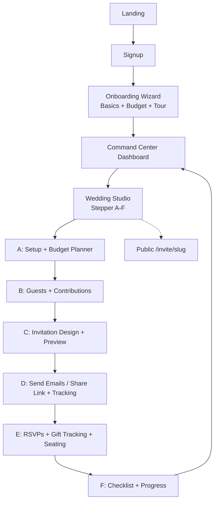

# TheWeddingTicket - Proposed User Flow & Information Architecture

**Date:** 2026-06 (continuation of premium redesign)
**Goal:** Transform the experience into a guided, delightful, beginner-friendly premium wedding planning + invitation platform. Reduce cognitive load, provide clear next steps, progressive disclosure, and make every user feel supported from "just engaged" to "wedding day".

## Core Principles
- **Guided Journey**: Everything feels like a natural story with "Next Step" CTAs, progress, and recommendations.
- **Command Center Dashboard**: At-a-glance health + prioritized actions (not just a list of weddings).
- **Step-by-Step Workflow**: Logical A→F path, but flexible (users can jump).
- **Delight & Polish**: Empty states with illustrations/guidance, tooltips, micro-animations (framer), success celebrations (confetti where appropriate), consistent elegant UI.
- **Mobile-First + Responsive**: Every screen works beautifully on phone (wizards especially).
- **Data Model Evolution**: Extend existing local-first service (easy to swap to Supabase). Add Budget + Gift tracking.
- **Email**: Keep beautiful preview + simulation for demo. Prepare clean integration path for Mailjet (or Resend). Track sent/opened.
- **No Breaking Changes**: Evolve existing tabs, components (seating, checklist, CSV, invite builder).

## High-Level Information Architecture (IA)

### Public
- `/` — Landing (premium hero + moodboard + value + pricing + testimonials)
- `/login`, `/signup`
- `/invite/[slug]` — Public invitation (beautiful, mobile, RSVP form, "Add to calendar", gift suggestion note if enabled)

### Authenticated
- `/onboarding` — New **Onboarding Wizard** (replaces basic 2-step)
- `/dashboard` — **Wedding Command Center** (multi-wedding overview + per-wedding deep links)
- `/dashboard/new` — Quick create (or part of onboarding)
- `/dashboard/weddings/[id]` — **The Wedding Studio** (main workspace for ONE wedding)
  - Sub-navigation / tabs or sidebar steps (A-F) with progress:
    - Overview / Command Center (summary + next actions)
    - A. Setup & Budget
    - B. Guests & Gifts
    - C. Design Invitations
    - D. Send & Track
    - E. RSVPs + Gifts Received + Seating (integrated)
    - F. Planning Checklist
  - Top persistent: Wedding name + date + "Share Link" + Breadcrumbs + "Back to Studio Dashboard"
  - "Guided Mode" toggle or always-on "Next Step" banner

### Navigation
- **Top Navbar**: Logo | Dashboard | (if in studio: Wedding name dropdown or crumbs) | Theme | User menu
- **Studio Sidebar (desktop) / Bottom tabs or accordion (mobile)**: Clear labeled steps with checkmarks/progress dots.
- **Breadcrumbs**: Home / My Weddings / Isabella & James / Guests
- **Global "Help"**: Tooltips + a "Take the Tour" button that highlights sections (using a simple spotlight or modal tour).

### Per-Wedding Data Extensions (new)
- Wedding: `budget: { total: number, categories: BudgetCategory[] }`
- Guest: `suggestedContribution?: number`, `actualGiftAmount?: number`, `giftReceived?: boolean`, `notes?: string`
- New: `BudgetCategory { id, name, budgeted: number, spent: number }`
- Enhance existing: Checklist progress, seating %, guests responded, emails sent, gifts total vs expected.

## Proposed End-to-End User Flow (Step-by-Step Journey)

### 1. Discovery & Acquisition (Landing)
- Beautiful photo hero.
- "Start Your Free Wedding Studio" CTA → /signup (or Google).
- Social proof + "See an example invitation" (links to a demo public invite).

### 2. Sign Up / Login
- Email or Google (simulated).
- Immediate redirect to **Onboarding Wizard**.

### 3. Onboarding Wizard (NEW - Major UX Win)
**Multi-step, delightful, not overwhelming (3-5 steps max, progress bar):**

- **Step 0: Welcome & Vision** (celebratory screen)
  - "Congratulations on your engagement!" + beautiful illustration or photo.
  - "We'll guide you through everything — invitations, guest list, seating, budget, and a full 12-month plan. It takes about 5 minutes to get started."
  - "Let's create your first celebration" button.

- **Step 1: The Basics** (core wedding info)
  - Partner 1 name, Partner 2 name
  - Wedding date (date picker with nice calendar feel)
  - Ceremony time, Reception time (optional)
  - "We'll use this to personalize your checklist and due dates."

- **Step 2: The Details** (venue + first budget seed)
  - Venue name, city, address (for invites + map later)
  - Dress code
  - Total estimated guest count (rough)
  - **Quick Budget Setup**: Total wedding budget? (slider or input, e.g. $25,000)
    - We auto-suggest categories (Venue 30%, Catering 25%, etc.) or simple "Start simple".
  - Optional: "Would you like to suggest a gift contribution amount per guest?" (e.g. $150). This powers gift tracking.

- **Step 3: Your First Guests (optional but encouraged)**
  - "Add a few important people now or import later."
  - Mini add-guest form or "Skip for now, I'll do this in the studio".
  - CSV upload teaser.

- **Step 4: Tour & Launch**
  - Beautiful "Here's what your Wedding Command Center will look like" (screenshots or interactive mini demo of dashboard + progress).
  - "Your personalized 12-month checklist is ready."
  - Big "Enter My Wedding Studio" → creates the Wedding record + seeds budget/categories + checklist + demo data if wanted.
  - Optional: "Take a 60-second guided tour" (modal with numbered highlights on first visit to dashboard/studio).

**After Onboarding**: Land on the **Wedding Studio page** for that wedding (or Dashboard if multiple). Show a "First Steps" success banner + "Next: Add your full guest list".

### 4. Dashboard = Wedding Command Center (Replaces simple list)
- Header: "Your Wedding Studio" + greeting + "New Wedding" button.
- **Hero Progress Overview** (big, delightful, one-glance):
  - Overall Wedding Readiness % (weighted: checklist 30%, guests responded 20%, seating 15%, invites sent 15%, budget planned 10%, gifts tracked 10% — or simple average).
  - 4-6 key metric cards (clickable):
    - Checklist: X% complete (links to F)
    - Guests: 42/120 confirmed (links to B)
    - Budget: $12,400 / $28,000 (20% over in one category) (links to A)
    - Invites Sent: 65/120 (links to D)
    - Gifts Received: $4,200 of expected $8,500 (links to E)
    - Seating: 38/120 seated (links to E)
  - **"Recommended Next Actions"** (smart, prioritized list — the magic):
    - If checklist < 30%: "Complete your venue booking in the planner" (with direct link + "Mark done")
    - If no guests: "Import or add your guest list (Step B)"
    - If guests but no invites sent: "Design & send your invitations"
    - If seating incomplete close to date: "Finalize seating chart"
    - "Review your budget" etc.
    - Always 2-4 smart cards/buttons with "Do this now" feel. Dismissible.
- List of all your weddings (with mini progress + cover photo + quick "Open Studio", "View Public Invite").
- Empty state: Aspirational + "Create your first..." + quick start tips.

**Breadcrumbs + Global Nav**: Always easy to go back.

### 5. The Wedding Studio — Guided Step-by-Step Core Workflow (A-F)

The main `/dashboard/weddings/[id]` page becomes the heart.

**Persistent UI Elements (for guidance)**:
- Top bar: Couple names + date + "Shareable Link" (copy + QR) + "View Public Page" + Progress ring (overall readiness).
- **Horizontal Stepper** (or vertical sidebar on desktop, top progress + mobile bottom nav):
  A. Setup & Budget (check if complete)
  B. Guests & Gifts
  C. Design Invites
  D. Send & Track
  E. Track RSVPs + Gifts + Seating
  F. Planning Checklist
- Each step header has: "Step X of 6", short description, "Why this matters", "Next Step →" button (smart — skips completed or suggests logical order).
- "Guidance Mode": Subtle coach marks or a floating "What should I do next?" that recommends based on state.
- Empty states in each section are rich: "No guests yet? Here's why adding them early helps with budget & seating..." + big "Add First Guest" or "Import CSV".

#### Step A: Wedding Setup & Budget (enhance existing "Event Details")
- Form for date/venue/time/dress/welcome (existing).
- **New: Budget Planner**
  - Total Budget input (editable).
  - Categorized breakdown (pre-filled realistic: Ceremony, Reception/Venue, Catering, Bar, Attire, Photography, Florals, Music, Stationery/Invites, Gifts/Favors, Transportation, Miscellaneous).
  - Per category: Budgeted amount + Spent (manual or later auto from gifts?).
  - Visual: Progress bars per category + total remaining.
  - "Suggested per-guest gift contribution": Input (e.g. $125). This auto-calculates "Expected total gifts" = guests * amount. Shown in later steps.
  - Save + "This helps us recommend gift tracking later".
- "Mark this step complete" button (feeds overall progress).
- Tooltips: "Most couples allocate 25-30% to the reception venue + catering."

**Next Step CTA**: "Great — now let's build your guest list so we can personalize invitations and track gifts."

#### Step B: Guest Management (enhance existing guests tab)
- Beautiful table (existing + new columns: Suggested Contribution, Actual Gift, Gift Received?).
- **Add Guest** modal/form with all fields (name required, email, phone, side, +1, dietary, contribution amount — prefilled from wedding's suggested, notes).
- **Import CSV/Excel** (existing advanced mapper — already good; enhance empty state).
- Bulk actions: Select → "Send invites to these", "Mark gifts received", "Assign to table" (links to seating).
- Search + filters (by side, status, has email, gift status).
- Summary bar at top: "120 guests • 45 confirmed • Expected gifts: $15,000".
- "Suggested Contribution" is per-guest editable (overrides wedding default).
- Empty state: "Start by adding your VIPs or importing your spreadsheet. This powers invitations, seating, and gift tracking."

**Next Step**: "Beautiful list! Time to design your invitation."

#### Step C: Invitation Creation (existing design tab + preview)
- Templates (existing 4 + more visual cards).
- Live preview (enhanced invitation-preview with cover photo, budget/gift note if enabled?).
- Customization (colors, fonts, cover upload — existing).
- Optional fields to include: "Gift contribution suggestion: $XX (optional note)".
- "Preview as Guest" button (opens the public page in new tab or modal).
- "Save & Mark Ready to Send".

**Next Step CTA**: Prominent "Ready to send? Let's deliver these beautiful invitations."

#### Step D: Sending Invites (existing email tab + enhancements)
- List or segmented: Guests with email / without.
- **Send Options**:
  - **Beautiful Email** (via preview modal — existing luxe template matching the invitation design + personal RSVP link + gift suggestion if set).
    - "Send to selected" or "Send to all with email (XX)".
    - Track: Sent date, Opened (demo or real).
  - **Shareable Link** (always available; copy, QR code, WhatsApp/ social buttons).
- **Tracking Table**: Email | Status (Not sent / Sent on DATE / Opened) | Actions (Resend, View as guest).
- Note: "For real delivery we recommend Mailjet / Resend. Demo simulates delivery and random opens."
- "Mark as physically mailed" for hybrid.

**Integration**: After send, progress on dashboard updates.

**Next**: "Invites are out! Let's watch the RSVPs roll in and start seating."

#### Step E: Tracking & Management (combine RSVPs + Gifts + Seating)
- **RSVP Dashboard** (existing rsvp-list + stats): Attending/Declined/Maybe counts, meal breakdowns, song requests, messages. Searchable.
- **Gift Tracking** (new dedicated or integrated panel):
  - Total expected vs received (based on suggested contributions + actuals).
  - Table: Guest | Suggested | Actual Gift | Received? (checkbox) | Notes.
  - "Record a gift" quick form.
  - Export for thank you notes.
- **Seating Chart** (existing powerful drag-drop — keep and tighten):
  - "Drag guests directly from the filtered guest list here."
  - Summary: "XX seated / YY total".
  - Integration: From guest list row "Assign to table" quick action.
- Real-time feel: Changes in one place reflect (via service + re-renders).

#### Step F: Planning Checklist (existing, tie in)
- Full 12-month categorized (existing).
- Progress % prominently shown + linked from dashboard.
- "Jump to related tool": e.g. seating item has button "Open Seating Chart".
- When you complete related actions (send invites, finalize seating), we can auto-suggest or auto-complete with confirmation.
- Filters + search (existing).

**Overall Completion**: When all steps have good progress, celebrate on dashboard ("Your wedding is beautifully planned!").

## Mobile Experience
- Studio uses responsive tabs or a "Progress" accordion + "Current Step" focused view.
- Wizard is vertical stack, excellent on phone.
- Tables become cards or have horizontal scroll + sticky columns where needed.
- Touch-friendly drag in seating (framer + HTML5 works; test or add long-press hints).

## Technical Notes / Implementation Order (Recommended)
1. Extend types + data-service (Budget, Gift fields on Guest/Wedding, new methods: updateBudget, recordGift, etc.).
2. Rebuild Onboarding as full wizard (multi-step with state, create wedding at end with budget seed).
3. Overhaul Dashboard into Command Center (progress calc, recommended actions logic, link improvements).
4. Enhance Studio navigation: Stepper component, "Next Step" logic, breadcrumbs.
5. Implement Budget UI in Step A (new component or section).
6. Enhance Guests (Step B) with contribution fields + gift columns.
7. Gift tracking UI in Step E.
8. Wire "Next Step" buttons + tooltips everywhere + empty states.
9. Email: Enhance simulation or prepare Mailjet (add env example, service method comment).
10. Polish: Animations, mobile, tooltips (use existing Popover or shadcn Tooltip if added), overall delight (progress rings, confetti on major milestones).
11. Update public invite to mention gift suggestion if set.
12. Seed richer demo data.

## Success Metrics (for later)
- Time from signup to first guest added < 3 min.
- % of users who complete at least 3 steps.
- Positive qualitative feedback on "I always knew what to do next."

This architecture keeps the beautiful existing components (seating canvas, checklist, invitation preview, CSV mapper) while wrapping them in a cohesive, guided narrative.

---

**Ready for implementation.** We will build this incrementally, starting with architecture confirmation, then types/service, onboarding, dashboard, then each workflow step with heavy focus on UX copy, states, and connections.

Mermaid overview of main flow (for reference):

All existing features (seating drag, checklist, CSV, live preview) are integrated into this flow.
